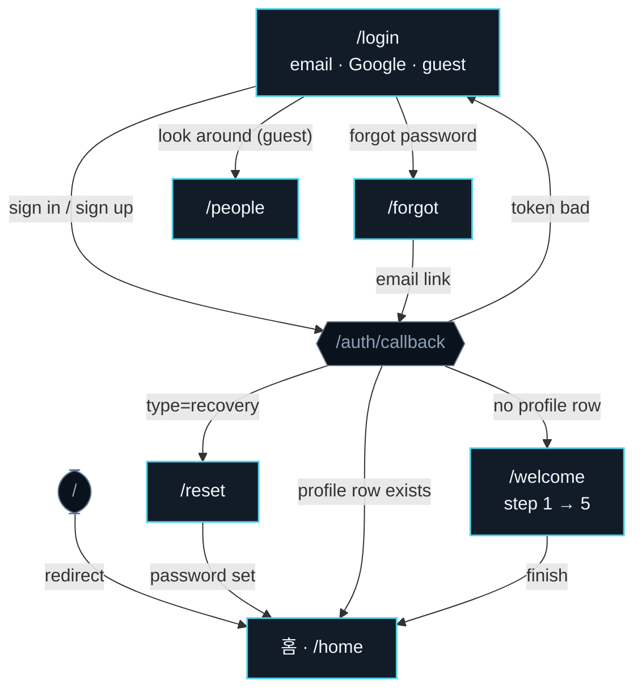
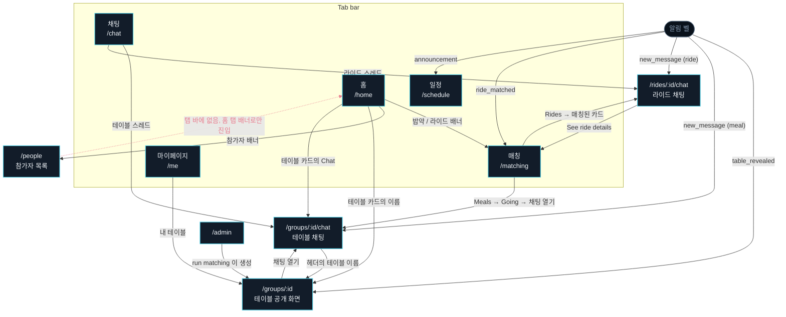

# Icebreaker

**A conference companion for UKC 2026** (Aug 5 to 8, ChampionsGate FL).

Make a profile, join a dinner, and get seated at a table of four to six people who
actually work on what you work on. Post your flight and split a car from the airport.
See who else is around before you arrive.

| | What it does |
|---|---|
| **Meal matching** | Claude groups dinner signups by shared research interests into tables of 4 to 6, and writes each table's "why you matched" line plus an icebreaker question. A deterministic packer takes over if the API is unavailable, so matching never fails. Come solo or bring a party of up to four; a party is never split. |
| **Ride matching** | Post a landing time and how wide a window you will accept. The app proposes the closest open carpool rather than auto-joining, and re-centers that pool's pickup time on everyone's real flight times when you join. |
| **People** | A directory with "arriving early / staying late / same dates as you" badges. KakaoTalk and LinkedIn stay hidden until you actually share a table or a ride, enforced in the database, not just the UI. |

Five tabs, in bar order: **일정** (announcement and schedule) · **채팅** · **홈**
(your hub, centered) · **매칭** (meals and rides) · **마이페이지**.

**Design:** a frost-navy ground (`#0A121C`) with one icy-cyan accent (`#4FD1E8`) used
only on actions and state, never decoration. Hairline dividers instead of cards,
underline inputs, Inter with a Noto Sans KR fallback. Korean-safe throughout. Demo data
(`scripts/seed-fake.ts`) uses Frozen-universe names as placeholder profiles.

*(Mentor 1:1 matching is descoped. The algorithm still lives in `lib/mentorMatch.ts`
but no route is wired to it.)*

---

## Screen flow: which screen leads where

Two views of the same graph: how a person gets **into** the app, and how they move
**between tabs** once inside. Generated by walking every `href`, `router.push`, and
`redirect` in `app/` and `components/`.

Legend: **solid** = wired and working · **dashed amber** = works, but only one way ·
**dotted red** = a connection that does not exist yet.

### Getting in



The **only** thing routing a new user into onboarding is whether a `profiles` row exists.
There is no "onboarded" flag.

### Moving between tabs



### Where each screen can take you

| 화면 | 나가는 길 | 상태 |
|---|---|---|
| 일정 `/schedule` | 없음. 공지와 일정을 읽기만 함 | 읽기 전용으로 의도된 화면 |
| 홈 `/home` | 매칭, 참가자, 내 테이블 채팅 | 정상 |
| 채팅 `/chat` | 테이블 채팅, 라이드 채팅 | 정상 |
| 매칭 `/matching` | 테이블 채팅, 라이드 채팅 | `?tab=rides`로 라이드 바로 열기 |
| 마이페이지 `/me` | 테이블 공개 화면, 로그인 | 정상 |
| 테이블 공개 `/groups/[id]` | 테이블 채팅 | 홈, 마이페이지, 채팅 헤더, 알림 |
| 테이블 채팅 | 테이블 공개 화면 | 정상 |
| 라이드 채팅 | 매칭 (Rides) | 정상 |

### 아직 연결되지 않은 곳

1. **참가자 목록이 탭 바에 없습니다.** 홈 탭의 배너 하나로만 들어갈 수 있습니다.
   탭 다섯 자리가 모두 차 있어서 의도적으로 둔 상태입니다.
2. **홈에 라이드 상태가 없습니다.** 항공편을 올리기 전에는 안내 배너가 뜨지만, 올리고
   나면 그 줄이 사라지고 대신 들어오는 것이 없습니다. 매칭된 풀도 픽업 시간도 홈에서는
   보이지 않습니다.
3. **라이드 스레드에는 안 읽은 개수가 안 붙습니다.** `message_reads.group_id`가
   `references groups`라서 풀 id로는 읽음 표시를 넣을 수 없습니다. 스레드 자체는
   채팅 탭에 나오지만, 배지를 붙이려면 그 테이블을 `(channel_type, channel_id)`로
   넓히는 마이그레이션이 필요합니다.

### 정리된 것 (2026-07-31)

- 채팅 탭이 라이드 스레드까지 함께 보여줍니다. 전에는 `channel_type = 'meal'`만
  조회해서 라이드 대화는 매칭 탭에서만 들어갈 수 있었습니다.
- 테이블 공개 화면으로 들어가는 길이 늘었습니다. "테이블이 정해졌어요" 알림이 채팅을
  건너뛰지 않고 이 화면으로 오고, 홈의 테이블 카드 이름도 여기로 연결됩니다. 누구와
  왜 묶였는지 보고 나서 대화를 시작하는 순서가 됩니다.
- 라이드 채팅에서 나가는 길이 생겼습니다. 로스터 시트의 링크가 매칭 탭의 Rides로
  갑니다 (`/matching?tab=rides`).
- 라이드 새 메시지 알림이 목록이 아니라 그 스레드를 엽니다.
- 진입점이 하나가 됐습니다. `/`도 로그인 후에도 `/home`으로 갑니다.

---

> **Heads up on Next.js:** this repo pins a Next.js version with breaking changes from what
> you may remember — APIs, conventions, and file structure can differ from older docs. Read
> the relevant guide in `node_modules/next/dist/docs/` before writing framework code, and
> heed deprecation notices.

## Stack

- **Next.js 16** (App Router, TypeScript, Tailwind v4) — route groups `(tabs)` and `(auth)`.
- **Supabase**: Postgres, Auth (email + password, Google, anonymous guest), Realtime, Storage (avatars), Row Level Security.
- **Anthropic** `claude-sonnet-5` for meal matching (with a deterministic round-robin fallback)
  and for reading flight-ticket screenshots on Rides. Group *names* come from a deterministic
  bank (`lib/groupName.ts`, `data/group-names.json`), not the LLM — see
  `docs/group-naming-logic.md`.
- **vitest** for unit tests.

## Setup

1. `npm install`
2. Copy `.env.example` → `.env.local` and fill in (see below). `.env.local` is gitignored —
   never commit it.
3. Apply the migrations to your Supabase project in order (see [Database](#database)).
4. `./start.sh` (boots the dev server, reuses one if already up, opens Chrome), or `npm run dev`.
5. Open http://localhost:3000.

### Environment variables (`.env.local`)

| Var | Purpose |
|-----|---------|
| `NEXT_PUBLIC_SUPABASE_URL` | Supabase project URL |
| `NEXT_PUBLIC_SUPABASE_ANON_KEY` | Anon (public) key — client + server reads under RLS |
| `SUPABASE_SERVICE_ROLE_KEY` | Service-role key — admin matching only, server-side |
| `ANTHROPIC_API_KEY` | Meal matching. Without it, matching uses the round-robin fallback |
| `ADMIN_EMAIL` | The one email allowed to run matching at `/admin` |
| `GEMINI_API_KEY` | Optional. Bespoke Claude/Gemini group names. Without it, the deterministic bank in `data/group-names.json` is used (this is already the default path — see `docs/group-naming-logic.md`) |

> `AERODATABOX_API_KEY` was for a live airport-arrivals feed (`lib/flights.ts`'s
> `fetchArrivals()`/`bucketIntoPools()`) that was never wired into any page — removed. Rides
> now matches on self-reported flight times (`Me` → post a flight → matched or grouped
> immediately, see `lib/rideMatch.ts`), no external arrivals API involved.

## Database

Apply migrations **in order** (`supabase/migrations/`). If you reset or recreate the DB,
re-apply all of them:

| File | What |
|------|------|
| `0001_core.sql` | 8 tables, `shares_channel()`, RLS policies, avatars bucket |
| `0002_directory.sql` | `directory_profiles` view + `can_see_contact()` |
| `0003_fix_group_members_rls.sql` | `is_group_member()` security-definer (fixes RLS recursion) |
| `0004_realtime_messages.sql` | adds `messages` to the realtime publication |
| `0005_party_size.sql` | `signups.party_size` (come-as-a-group); drops old `group_size_pref` |
| `0006_flights_mentor.sql` | `flights` table (self-reported arrival/departure, powers Rides) + `profiles.mentor_optin` |
| `0007_birthday.sql` | `profiles.birthday` (optional, collected during onboarding) |
| `0008_profiles_contact_rls.sql` | **Security fix.** Tightens `profiles` SELECT so only the owner or someone who shares a channel with them can read a row — closes a gap where any signed-in user (including guests) could read anyone's kakao/linkedin/dietary/birthday directly, bypassing the app's "contacts unlock only when you share a table" gate. Apply this one promptly. |
| `0009_event_stay.sql` | `profiles.event_id`/`stay_start`/`stay_end` (onboarding's Event & stay step) + adds the stay columns to `directory_profiles` |
| `0010_hi_requests.sql` | `hi_requests` table + RLS — People's "Say hi" request, deliberately not wired into `shares_channel()` |
| `0011_ride_join.sql` | Links `ride_pools` to `flights` (`anchor_flight_id`) + adds the missing insert policy — Rides' "Share" now really joins a pool (capacity 4, closes once full) instead of being a client-only stub |
| `0012_conference.sql` | `conferences` table. The event's name/dates/timezone/airport and the auto-matching schedule become an admin-registered row instead of hardcoded constants |
| `0013_message_reads.sql` | `message_reads`, a per-user last-read timestamp, powers the unread count on the 채팅 tab |
| `0014_notifications.sql` | `notifications` table + realtime; all inserts are cross-user so they go through the service-role client |
| `0015_group_starter_question.sql` | Renames `groups.suggested_place` → `starter_question`. The LLM now writes an icebreaker question instead of inventing a venue it has no data for |
| `0016_schedule_announcement.sql` | `schedule_items` + announcement, the 일정 tab's admin-editable agenda |
| `0017_notification_types.sql` | Widens the notification type check: new chat message, new/changed announcement |
| `0018_ride_matching.sql` | Rides get real find-or-create matching by time, replacing browse-and-join |
| `0019_ride_member_left.sql` | Notifies the rest of a ride pool when someone leaves |

Apply via the Supabase dashboard SQL editor (paste each file, Run), or the Supabase CLI.

## Scripts

```bash
# Seed real dinner slots (Wed/Thu/Fri dinners + Sat lunch)
npx -y tsx --env-file=.env.local scripts/seed-slots.ts
# Seed ~20 fake users onto Day 2 Dinner (for testing matching)
npx -y tsx --env-file=.env.local scripts/seed-fake.ts
# Print a local login link for an email (no inbox needed) — dev only
node --env-file=.env.local scripts/dev-magiclink.mjs you@example.com
# Tests
npx vitest run
```

## Deploy

See the running deploy checklist in [`docs/HANDOFF.md`](docs/HANDOFF.md#deploy-to-vercel-checklist).

## Docs

- `docs/HANDOFF.md` — build status, DB state, deploy checklist, human TODOs.
- `docs/UX-GAP-AUDIT.md` — prioritized conference-goer gap list.
- `docs/group-naming-logic.md` — how tables get playful names instead of "Table N".
- `docs/mentor-match-logic.md` — mentor/mentee role derivation and pairing logic.
- `docs/superpowers/specs/` — design specs (product spec, party-size).

---

## How matching works

**Meal matching:** an admin opens `/admin` and runs matching for a slot. Signups are packed into
tables of 4–6 *by headcount* — a party of 3 always sits together and merges with, say, a
party of 2 into a table of 5. Claude writes each table's "why you matched" rationale and an
icebreaker question the table can open with; if no API key is set (or validation fails), a
round-robin fallback produces correct tables with a generic rationale. Table *names* always
come from the deterministic bank in `lib/groupName.ts`, keyed off the group's shared
interests/field. Matching also runs unattended via `/api/cron/auto-match` when the
conference has `auto_matching_enabled`.

**Ride matching:** posting a flight searches for an open pool in the same direction whose
pickup time is within your chosen window, and *proposes* it rather than auto-joining
(`lib/rideMatch.ts`). Joining re-centers the pool's pickup time on every member's actual
flight time. Cancelling is allowed up to the night before.

**Mentor matching:** descoped. The role-derivation and pairing logic still lives in
`lib/mentorMatch.ts` and is exercised by `/match-demo`, but there is no `/mentor` route.

**Contact unlock:** KakaoTalk / LinkedIn are hidden in the directory until you and the other
person share a *meal group* **or a ride pool**, enforced in the DB by `can_see_contact()` /
`shares_channel()`. Since `0011`, joining someone's flight on Rides writes a real
`ride_members` row (capacity 4, same table `shares_channel()` already checked but nothing
used to populate), so people who share a ride now unlock contacts too — same mechanism as
sharing a table, no extra code needed for it.
